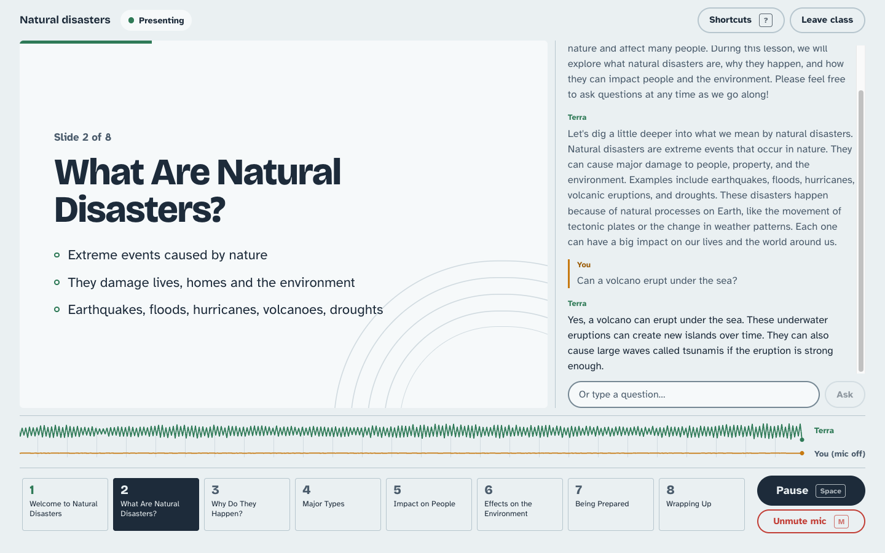
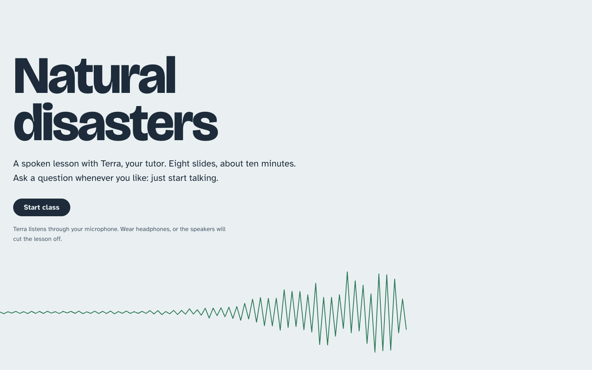
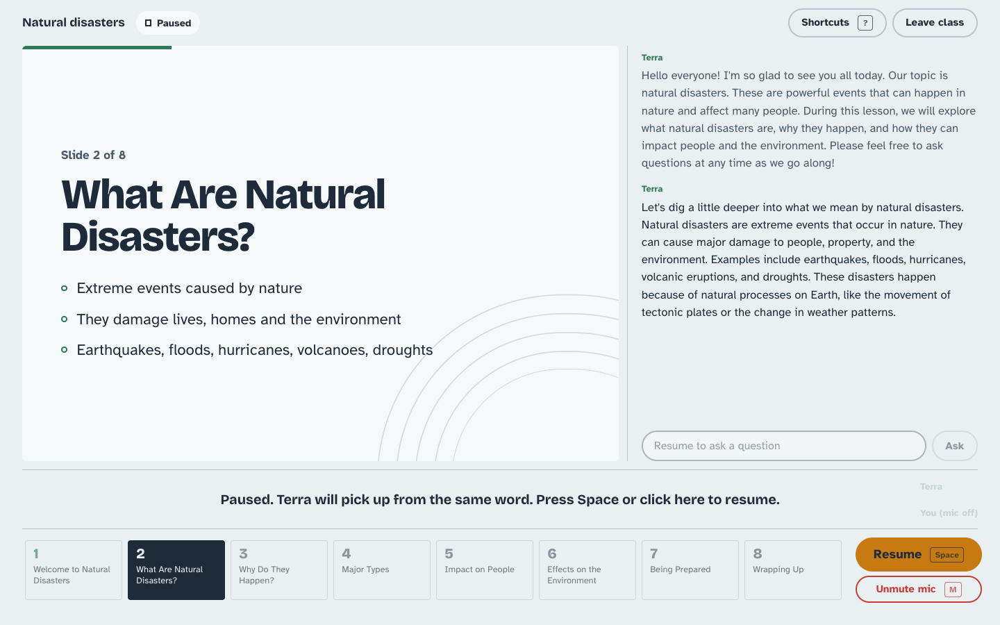
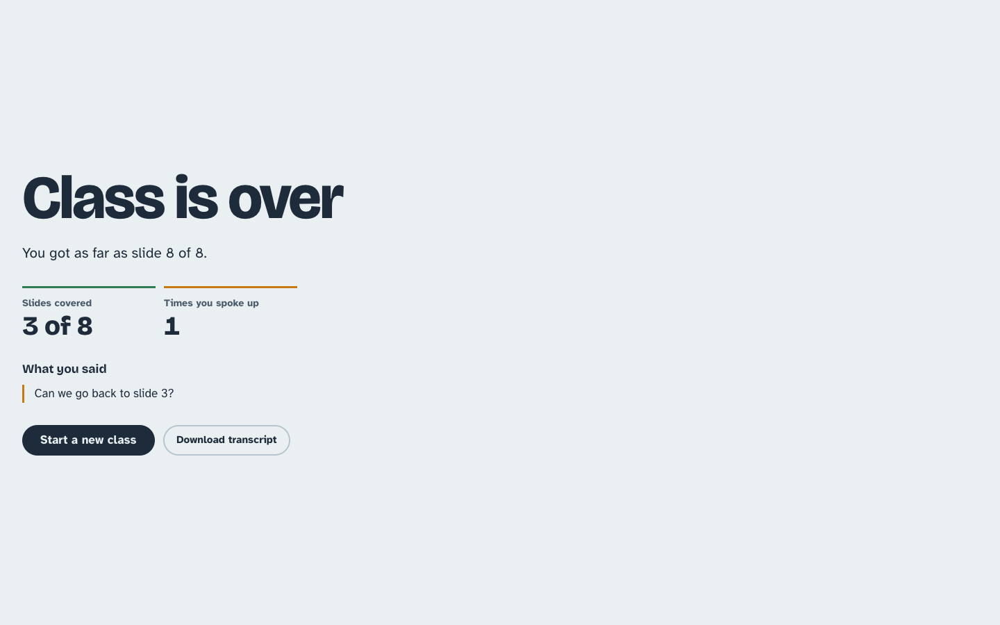

# Terra — a voice tutor for a class on natural disasters

Terra is a spoken tutor for students aged about 10 to 14. It presents an eight-slide lesson on
natural disasters out loud, answers questions whenever a student speaks up or types, returns to
the slide it was on, and finishes with an open question-and-answer session. The lesson can be
paused mid-sentence and picks up on the same word when resumed.

It is built on [pipecat](https://github.com/pipecat-ai/pipecat) and OpenAI only, as the
assignment requires: `gpt-4o-transcribe` for speech-to-text, `gpt-4o` for the tutor, and
`gpt-4o-mini-tts` for the voice. The browser client is plain TypeScript with Vite, using the
pipecat client SDK over a websocket.



| Landing | Paused | End of class |
| --- | --- | --- |
|  |  |  |

## Running it

You need [uv](https://docs.astral.sh/uv/), Node 18 or later, a microphone, and an OpenAI API key.

Create `.env` in the repository root:

```shell
OPENAI_API_KEY=sk-...
# Optional, with their defaults:
# HOST=127.0.0.1
# PORT=7860
# ALLOWED_ORIGINS=http://localhost:5173,http://127.0.0.1:5173
# TUTOR_LLM_MODEL=gpt-4o
# TUTOR_TTS_VOICE=coral
```

Start the agent:

```shell
uv sync
uv run python main.py
```

Start the frontend in a second terminal. The lockfile is Yarn 1; Node 25 no longer ships
corepack, so `npx` fetches the right Yarn:

```shell
cd frontend
npx -y yarn@1.22.22 install
npx -y yarn@1.22.22 dev
```

Open <http://localhost:5173>, allow the microphone, and press **Start class**.

`ALLOWED_ORIGINS` lists the pages that may open the websocket. If you serve the frontend from
another address, add it there. The agent binds to localhost unless `HOST` says otherwise.

## What the student can do

- **Listen and follow along.** The current slide is on screen with a progress bar, and
  captions appear as each sentence is spoken, not before.
- **Ask out loud.** Speaking interrupts Terra. It answers in a few sentences, then picks the
  slide back up where it left off.
- **Type a question.** The box under the captions sends a question the same way, for students
  without a mic or in a noisy room. The text stays in the box, locked, until Terra takes it.
- **Jump to a slide.** Click a slide thumbnail, press 1–8, or just say "go back to the
  earthquake slide". This also works during the final Q&A, and the lesson carries on from
  there.
- **Pause and resume.** Terra stops mid-word and resumes from the same point, with nothing
  skipped or repeated. The mic is ignored while paused.
- **Mute the mic** without leaving the class.
- **Scroll back** through the captions. New lines stop pulling the view down while the student
  is reading further up.
- **Finish.** After slide 8 Terra moves into open Q&A. Leaving the class shows a summary
  (slides covered, how many times the student spoke up) and a download of the whole transcript.

### Keyboard shortcuts

| Key | Action |
| --- | --- |
| <kbd>Space</kbd> | Pause or resume |
| <kbd>M</kbd> | Mute or unmute the mic |
| <kbd>/</kbd> | Type a question |
| <kbd>1</kbd>–<kbd>8</kbd> | Ask Terra to go to that slide |
| <kbd>?</kbd> | Show the shortcut list |
| <kbd>Esc</kbd> | Close the list, or leave the question box |

Shortcuts are ignored while the student is typing. The page has visible focus states, announces slide
changes to screen readers, and respects reduced-motion settings.

## How it works

```
 Browser (frontend/)                              Agent (main.py, tutor/)
 ─────────────────────                            ──────────────────────────────────────────
                                                  pipecat Pipeline
 mic ──────────── audio ─────────────────────────▶ transport.input
                                                     │
                                                  STT  (gpt-4o-transcribe, Silero VAD)
                                                     │
                                                  user context aggregator  (muted while paused)
                                                     │
                                                  LLM  (gpt-4o, go_to_slide tool)
                                                     │
                                                  TTS  (gpt-4o-mini-tts)  ── emits `caption`
                                                     │
                                                  PauseGate  (holds frames while paused)
                                                     │
 speaker ◀─────── audio, captions ────────────────  transport.output
                                                     │
                                                  assistant context aggregator

 session.ts ── pause, resume, ask, go-to-slide ──▶ LessonController  (pipeline observer)
            ── playback-started / -idle ─────────▶   ├─ Presentation   (pure state machine)
            ◀─ lesson-state ──────────────────────   └─ stage directions into the LLM context
```

- **`tutor/presentation.py`** is a pure state machine with no pipecat imports: which slide is
  current, whether we are presenting or in Q&A, whether we are paused. Each event returns the
  next action (present a slide, continue it after a question, open Q&A), which keeps the
  lesson flow deterministic and easy to test.
- **`tutor/controller.py`** (`LessonController`) watches the pipeline's frames as an observer.
  When the tutor has finished speaking and the browser has finished playing, and the student
  has stayed quiet for two seconds, it feeds the next step of the state machine into the LLM
  as a stage direction. It also handles the messages from the browser and sends `lesson-state`
  back.
- **`tutor/prompts.py`** holds everything the LLM is told: the persona and safety rules, and
  the stage directions. Only the latest stage direction is kept in the context, so the model
  never has to work out which slide is current.
- **`tutor/pause.py`** holds the pipeline's output while paused. **`tutor/captions.py`** sends
  each sentence's caption just before that sentence's first audio.
- **`tutor/slides.py`** is the deck: titles and bullets for the screen, and a speaker brief for
  the LLM. `GET /slides` serves it to the frontend, so there is one source of truth.
- **`frontend/src/session.ts`** wraps the pipecat client. **`playback.ts`** is the only module
  that touches the transport's private audio player, to freeze playback on pause and to report
  when the browser's audio queue runs dry. **`store.ts`** is a small store the `ui/` modules
  render from.

## Decisions worth explaining

**Pause is done on both sides.** pipecat sends audio at twice real time, so by the time the
student presses pause, several seconds of speech are already queued in the browser. The
browser suspends its `AudioContext`, which freezes playback on the exact sample and keeps
queuing whatever arrives. The server's `PauseGate` holds everything that has not been sent yet.
On resume the browser plays its queue first and the server's held audio lines up behind it, so
nothing is lost or repeated.

**The browser says when it has finished playing.** For the same reason, the server's "bot
stopped speaking" event fires up to half an utterance before the student hears the end. If the
next slide were timed from that, Terra would talk over itself. The browser reports
`playback-started` and `playback-idle`, and the next slide waits for both. A client that never
reports falls back to server timing.

**Returning to the topic is the lesson system's job, not the model's.** The prompt tells Terra
to answer a question and stop. Once the answer has been played, the controller issues a
"continue this slide" stage direction. A model left to bridge back on its own drifts, asks
"shall we carry on?" and waits for an answer nobody gives.

**Jumping slides uses a tool call.** "Go back to volcanoes" is matched to a slide number by the
LLM with the `go_to_slide` tool, from an outline in the base prompt. The new stage direction is
added only after the tool result is in the context, because OpenAI requires a tool result to
follow its call directly.

**Requests from the UI wait for the interruption.** A typed question or a thumbnail jump first
interrupts the tutor, and only acts once pipecat's `InterruptionFrame` has gone through, so the
interruption cannot cancel the new reply. The `lesson-state` answer to that request marks the
boundary: audio and captions from the speech that was cut off are dropped by the browser until
it arrives. A second request while one is pending is refused, and the UI shows it.

**A failed reply does not freeze the class.** If the reply to a question or jump never makes a
sound (an LLM or TTS error), a 15-second timeout lets the lesson carry on. It never re-asks the
LLM, so a slow reply is not answered twice.

**Children are the audience.** The persona speaks in short, plain sentences. Descriptions of
injuries stay gentle, a scared student is reassured and pointed to a trusted adult, personal
details are never asked for, and unsafe requests are declined. The voice has a fixed style
because each sentence is a separate TTS request, and without it the voice drifts between
sentences. Voice detection is strict so classroom noise is not taken for a question.

**The websocket only accepts known pages.** Any website can open a websocket to localhost, so
`/ws` checks the `Origin` header against `ALLOWED_ORIGINS`, and the agent binds to localhost by
default.

## Tests

```shell
uv run pytest -q                              # 93 tests
uvx ruff check tutor main.py tests
uvx ruff format --check tutor main.py tests
cd frontend && npx -y yarn@1.22.22 build      # tsc + vite build
```

The tests are deterministic and never call OpenAI. They cover the state machine (slide order,
the last slide presented before Q&A, returning to the same slide after a question, jumps from
Q&A), the controller against fake frames and clocks (frame dedupe, pause and resume, playback
reports, refused requests, the reply timeout, tool-result ordering), the prompts, the pause
gate, caption timing, and the websocket origin check.

The frontend has no test runner. It is checked by `tsc` and by driving the real modules in
Playwright against the dev server, with a fake pipecat client where a microphone is needed.

## Known limits

- `/connect` returns `ws://localhost:{PORT}/ws`, so the frontend and agent have to run on the
  same machine. Proxying the websocket through Vite would fix this, but it changes what the
  `Origin` check sees, so it was left for later.
- The recent fixes to typed questions and jumps while another request is pending, caption
  timing after an interruption, and caption scrolling are covered by unit tests and Playwright,
  but have had less testing in a live class than the rest.
- Two planned features were cut for time: a "raise hand" button, and a short LLM-generated quiz
  in the Q&A.
- Of the assignment's additional goals, only the child-safety rules in the prompt and the
  deterministic tests are done. There are no LLM-as-a-judge evals, no knowledge ingestion, no
  metrics report on disconnect (pipecat's metrics are enabled but not summarised), and old
  transcripts are downloadable but not yet used to improve the tutor.
